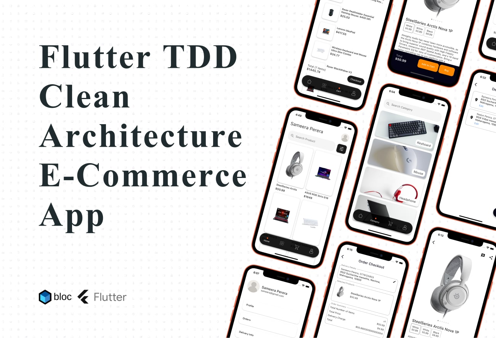

# e_commerce_clean_arcitecture

Flutter TDD Clean Architecture E-Commerce App - E_commerce
📦 Welcome to the Flutter TDD Clean Architecture E-Commerce App
This repository presents a comprehensive E-Commerce mobile application developed using Flutter 3, following the principles of Clean Architecture, Test-Driven Development (TDD), and the BLoC (Business Logic Component) state management pattern.

The project serves as a practical demonstration of modern mobile app development best practices, aimed at building applications that are scalable, maintainable, and efficient. By combining architectural discipline with Flutter’s UI capabilities, this app highlights how professional-grade mobile solutions can be built using clean, testable, and modular code.

## Key Features:

Test-Driven Development (TDD):
This project emphasizes writing tests before implementing features. It ensures the app's business logic is robust, maintainable, and less prone to regression.

Clean Architecture:
The app adopts a layered architecture—Presentation, Domain, and Data—to promote separation of concerns, modularity, and scalability.

BLoC State Management:
Utilizing the BLoC (Business Logic Component) pattern, the app achieves a reactive and well-organized state flow, improving code structure and app performance.

Firebase Integration:
Firebase is used for authentication, as well as for storing and managing user data, orders, and other real-time interactions, offering a seamless backend solution.

E-Commerce Functionality:
The application delivers a complete E-Commerce experience: users can browse and search products, add them to the cart, and place orders easily through an intuitive UI.

- [Lab: Write your first Flutter app](https://docs.flutter.dev/get-started/codelab)
- [Cookbook: Useful Flutter samples](https://docs.flutter.dev/cookbook)

For help getting started with Flutter development, view the
[online documentation](https://docs.flutter.dev/), which offers tutorials,
samples, guidance on mobile development, and a full API reference.
